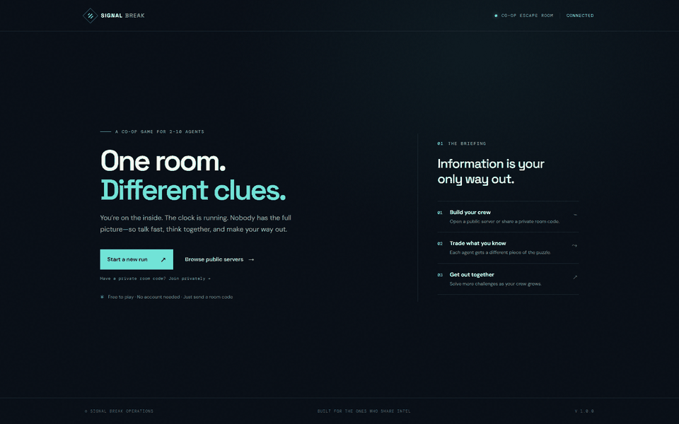
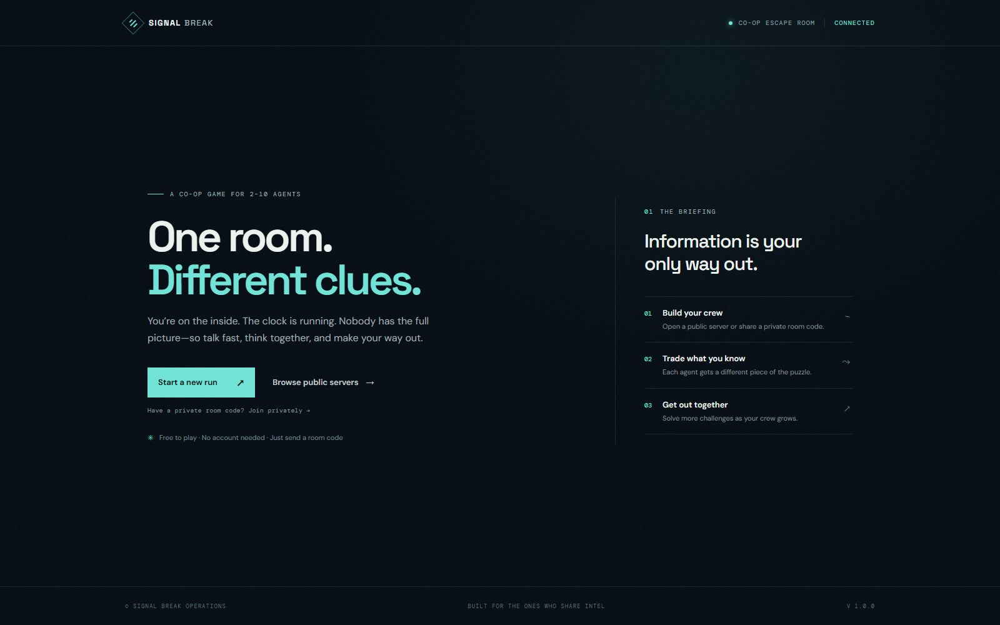
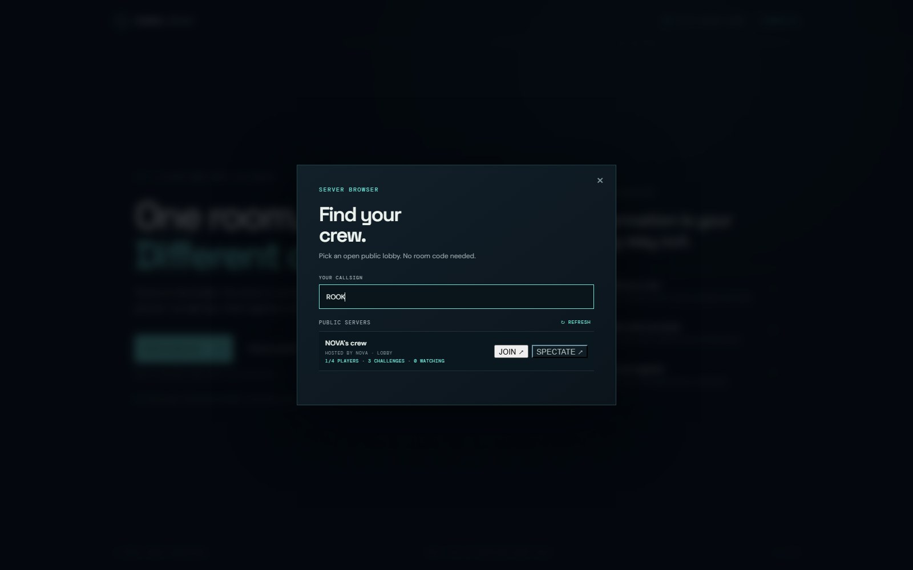
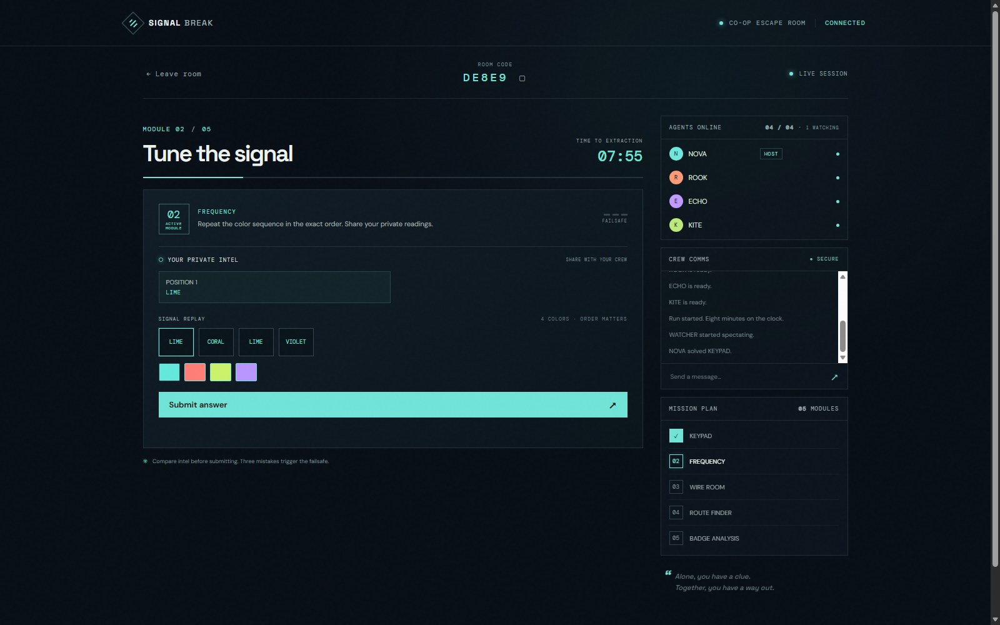
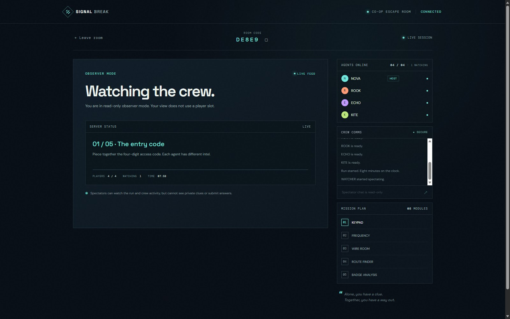

# Signal Break

**Signal Break** is a cooperative, multiplayer escape-room game that runs in a web browser. Build a crew, share private clues, and solve a sequence of different challenges before the eight-minute extraction timer runs out. Players can join public rooms, create code-protected private rooms, or watch a run as spectators.

## See the game

Here is a short animated walkthrough, from the lobby through the challenge rooms and a completed run:



Screenshots from the game:

| Lobby | Public server browser |
| --- | --- |
|  |  |

| Frequency challenge | Spectator view |
| --- | --- |
|  |  |

## How to play

1. **Create or find a room.** Host a public room that appears in the server panel, or make a private room and share its join code. Public rooms can also be joined directly from the panel.
2. **Choose the crew size.** The host sets a limit from **2 to 10 players**. Once the crew is ready, the host starts the run.
3. **Share your clues.** Each player receives private intel. Talk through the clues in crew chat and combine what everyone knows to work out each answer.
4. **Solve the modules.** Complete the challenges before the timer reaches zero. Three incorrect submissions trigger the failsafe and end the run.
5. **Watch if you prefer.** Spectators do not take a player slot, see private clues, or submit answers. They can watch public rooms from the server panel. To spectate a private room, enter its private room code.

## Challenges

Each run mixes different puzzle interactions so the crew has to adapt:

- **Keypad:** combine distributed clues to enter the correct code.
- **Frequency:** replay a color sequence in the right order.
- **Wire Room:** identify and cut the safe wires.
- **Route:** follow directional clues to submit the correct route.
- **Odd One Out:** compare the crew’s shape reports to identify a forged badge.

A run has **3 challenges with two players**, then adds one challenge for each additional player, up to **11 challenges for a 10-player crew**. A larger crew brings more private clues and a longer run of challenges.

## Features

- Browser-based co-op game with live multiplayer updates.
- Public room browser and private rooms with shareable codes.
- Host-selected room limit from 2–10 players.
- Public and private spectator mode; private spectators must enter the room code.
- Different private clues for each player, built to encourage communication.
- In-room crew chat. Messages sent by your own player are marked **“(you)”**.
- Ready checks, an eight-minute run timer, mistake tracking, and a failsafe.
- Rematch controls when a run is complete.
- Responsive layout for desktop and smaller screens.

## Run it locally

You need **Node.js 18 or newer** and npm.

```sh
npm install
npm start
```

Then open [http://localhost:3000](http://localhost:3000) in your browser. To play together on the same computer or local network, keep the server running and have everyone open the same server address. Use the machine’s network address instead of `localhost` for other devices on your local network.

## How it works

- **Node.js and Express** serve the browser game and its static files.
- **Socket.IO** keeps connected players in sync: room creation and discovery, player presence, ready state, chat, private clue delivery, puzzle answers, timers, spectators, and rematches.
- **The server owns the room state and validates answers.** Clients render the current room and send player actions over the socket connection.
- **Rooms are held in memory.** Restarting the Node server clears rooms and active runs.

For friends to join from outside your network, deploy the Node app to a host that supports long-lived WebSocket connections and share its URL. A public deployment also needs a plan for exposing it to the internet; this repository does not include hosting or account services.

## Project layout

```text
public/       Browser interface, styles, and client-side game code
server.js     Express app, Socket.IO connection handling, and room logic
docs/media/   README screenshots and animated walkthrough
```

## Media

The README preview uses screenshots captured from the running game. `docs/media/walkthrough.gif` is an animated sequence of the lobby, challenge screens, spectator view, and run completion.
